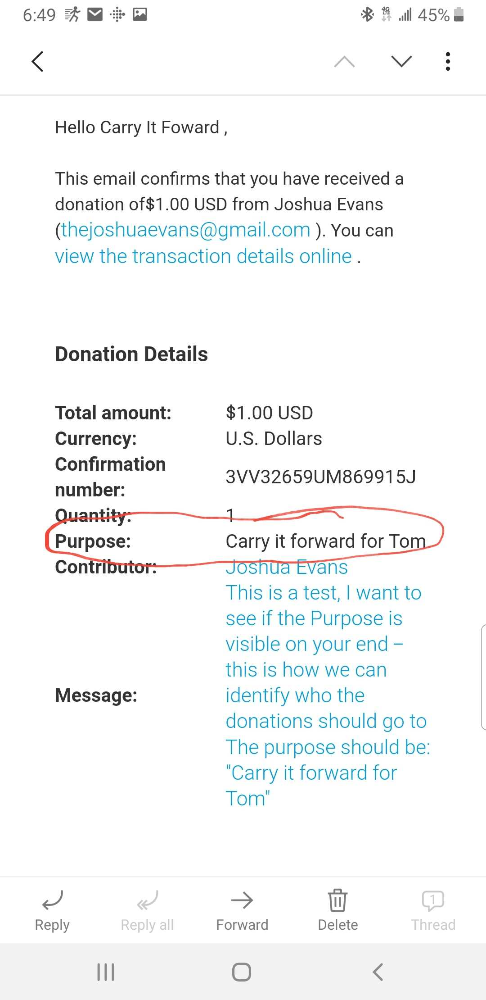
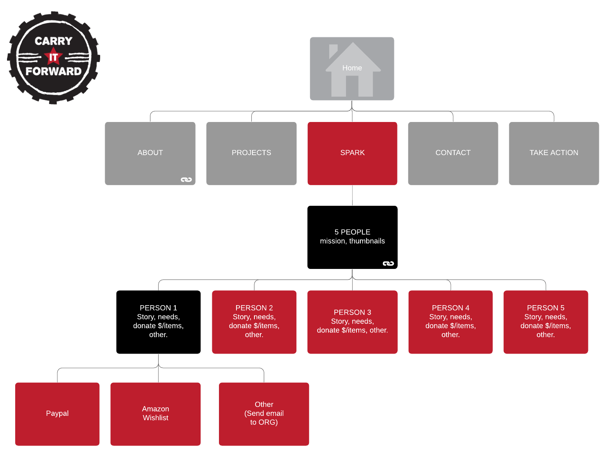
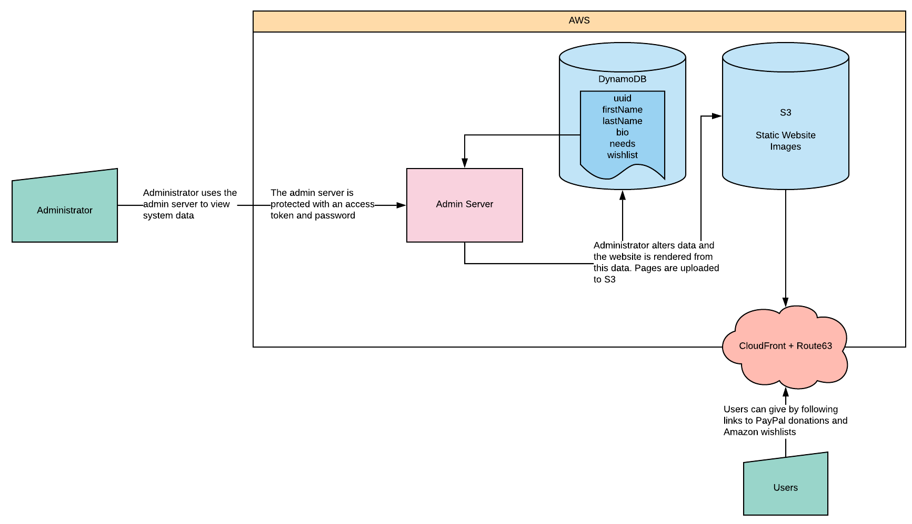

# Carry it Forward by Slacker Hackers
Made for "Hack for a Cause" 2019

Demo website is available for viewing at https://carryitforward.trifoia.com/

## Abstract
Carry It Forward Spark is a new program we're implementing to help specific individuals in the community with the items and support they need. Every month Carry It Forward chooses 5 worthy unhoused individuals to tell you their story and what they need to survive and thrive.

You can choose to donate items directly, give money towards their purchase or offer help in other ways. Please read their stories and help in any way you're able.

## Concept
This is a demo of the possible capabilities of this system. Turns out 42 hours is not a lot of time to develop a production ready system - but it isn't that far off

## Front End
Donations are handled completely by 3rd parties, this greatly reduces maintenance and management overhead while still providing all the services necessary. The following donation methods are or will be supported:
- [x] PayPal donations
- [ ] Amazon Wishlists (not yet supported)

PayPal donations will be given a "Purpose" value associated with a specific person, or associated with the program as a whole, so that funds can be allocated correctly. The donation when received will look like this:

Amazon Wishlist links will be supported, allowing administrators to add wishlists for people after creation

The following webmap describes what the site will look like in its final form

## Back End
To ensure scalability and reduce costs, AWS S3 + CloudFront static web hosting is used to host all web pages. Since all transactions are handled by 3rd parties, there is no need to maintain an expensive, scalable, server environment for these simple webpages

Administration will be handled via a small admin server that will be responsible for allowing admins to view and edit data. Once an admin is satisfied with the data present on the admin page, they can render the website, which will make all the appropriate updates automatically. The admin page will be protected by both an access token (in the url) and a password to prevent bad actors gaining access to the system. Dynamic user data is stored using AWS DynamoDB

The following diagram describes the administration and hosting requirements

### Backend Todo:
- [x] Static hosting via S3 + CloudFront
- [x] Person data stored on DynamoDB
- [ ] Admin server dashboard complete
  - [x] Database viewing
  - [ ] Database editing
  - [x] Person page rendering
  - [ ] Home page rendering
  - [ ] Static site updating
- [ ] Admin server hosted

## Cost
Assuming low user engagement (~10 unique users per day) this project should cost approximately **$10 per month** to operate, if that. The bulk of this costs is for hosting of the administration server, while the remainder will slowly scale with usage. This cost includes domain registration and maintenance costs (spread out over a year)
